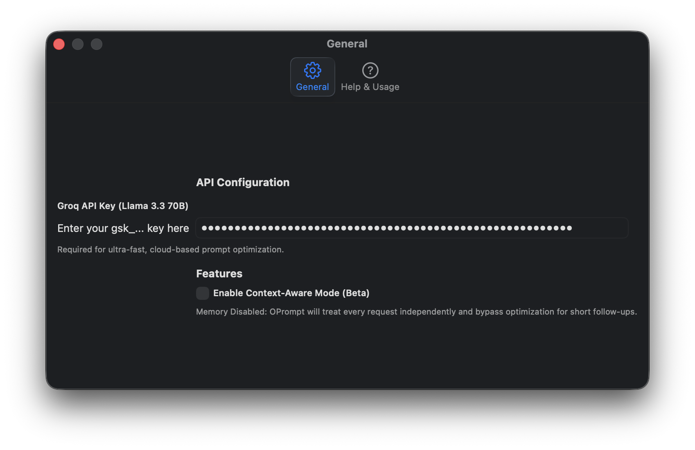

# OPrompt ✨

**A native macOS utility that turns any text field into an AI-powered prompt optimizer.**


OPrompt acts as a "Universal AI Translation Layer." It runs silently in your menu bar and bridges the gap between rough human thoughts and the highly structured, constraint-heavy prompts required by advanced LLMs. 

Simply press **Cmd + Shift + O** in *any* application (Chrome, Xcode, Notes, Slack), and OPrompt will instantly read, rewrite, and replace your text natively using the lightning-fast Groq API (`llama-3.3-70b-versatile`).

---

## 🚀 Key Features

*   **⚡️ Global In-Place Optimization:** Hit `Cmd + Shift + O` to optimize text right where you are typing. No web interfaces or copy-pasting required.
*   **🎯 Auto-Select:** If you don't highlight anything, OPrompt automatically selects all the text in your active text field.
*   **👻 Ghost Templates:** Type a bracketed tag like `[SEO]` or `[Code]` anywhere in your text. OPrompt detects this and forces the AI to adopt that specific persona for the rewrite.
*   **🧠 Intelligent Routing:** Differentiates between *new ideas* (which get a heavy 4-pillar optimization: Role, Task, Tone, Constraints) and *conversational follow-ups* (which bypass heavy optimization to preserve the target AI's context).
*   **🔒 Context-Aware Soft Memory (Beta):** Maintains a short-term (15-minute) memory of your last 5 prompts to understand vague follow-ups (e.g., "make it shorter"). Memory is strictly isolated by App Name and Window Title, preventing context from bleeding between different browser tabs (e.g., ChatGPT vs. Claude).
*   **🛡️ Robust Compatibility:** Uses native macOS Accessibility APIs (`AXUIElement`) for seamless text replacement, with an automatic smart Clipboard Fallback (`Cmd+C`/`Cmd+V`) for complex web apps (like Notion or ChatGPT).

---

## 🖼️ User Experience

*Include screenshots of the app in action here.*

### The Settings Interface

*A native SwiftUI settings window to manage your Groq API key, toggle Context-Aware Memory, and review the quick-start guide.*

### In-Action Example

*Before: "write an essay on yoga day"*
*After: "Act as an expert writer and compose a well-structured essay on International Yoga Day, incorporating historical context, health benefits..."*

---

## 🛠️ Installation & Setup

1. **Clone the repository:**
   ```bash
   git clone https://github.com/yourusername/OPrompt.git
   ```
2. **Open in Xcode:**
   Open the folder in Xcode to build and run the application.
3. **API Key Setup:**
   * Run the app. 
   * Click the OPrompt icon `◇` in your macOS Menu Bar.
   * Go to **Settings**.
   * Enter your [Groq API Key](https://console.groq.com/keys).
4. **Permissions:**
   * On first run, macOS will prompt you to grant **Accessibility** permissions (required to replace text) and **Automation** permissions (required to fetch window titles for context isolation).

---

## 👨‍💻 Tech Stack
*   **Language:** Swift
*   **UI Framework:** Pure SwiftUI (`MenuBarExtra` and `SettingsLink`)
*   **Automation:** macOS Accessibility API (`AXUIElement`), `NSEvent` (Global Hotkeys), `CGEvent` / `NSPasteboard` (Clipboard Fallback), and AppleScript.
*   **AI Engine:** Groq Cloud API (Meta's Llama 3.3 70B Versatile).

## 🔮 Roadmap
- [ ] **Local Privacy Mode:** Re-introduce Ollama toggle for offline enterprise usage.
- [ ] **Auto-Routing:** Automatically open the target AI (ChatGPT/Claude) in your default browser after a prompt is optimized.

## 📝 License
MIT License - feel free to fork, modify, and build upon this!
